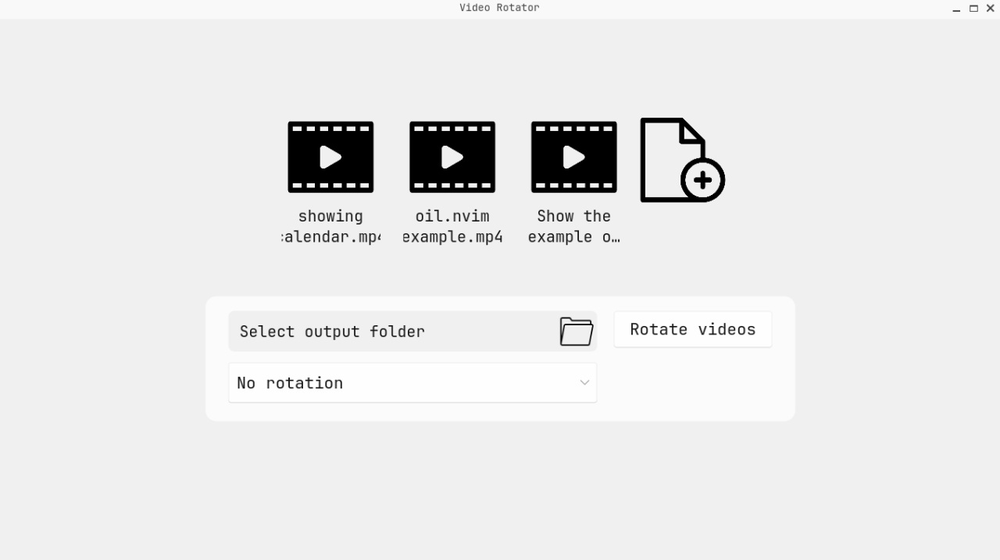

# Video Rotator



The simple GUI application that lets you rotate multiple video files with just a few clicks.
It processes all selected videos and saves the rotated versions as new files — your original videos remain untouched.

## Features

- Rotate videos by 90°, 180°, or 270°
- Batch process multiple videos at once
- Saves results to new files (no overwriting)
- Simple and lightweight graphical interface

## Requirements

**Core dependencies**:

- Rust toolchain
- pkg-config
- LLVM 20
- clang
- FFmpeg 8 (full build)
- x264
- NASM

**GUI dependencies**:

- libGL
- KDE Frameworks
  Normally, only two specific KDE libraries are needed for the application to compile.
  However, due to a “argument list too long” error during compilation, the current environment includes the full KDE package set (kdePackages.full) as a workaround.

## Installation

Ensure that you have all libraries for compilation and run the command:

```bash
cargo install --path .
```

## Future development

The application is currently in **maintenance mode**.
No new features are planned beyond essential updates.
Future work will focus on maintaining compatibility with new video codecs and ensuring smooth operation with evolving multimedia libraries.
